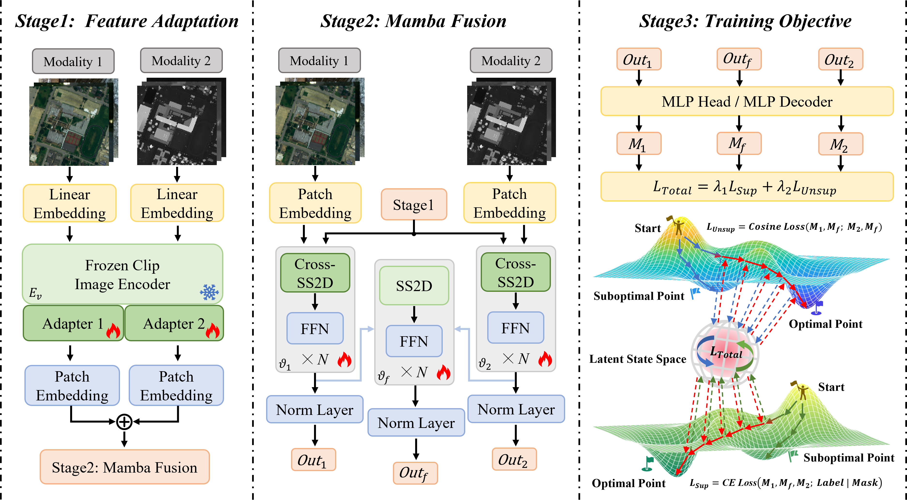

<div align="center">
<h1> M<sup>3</sup>amba </h1>
<h3> M<sup>3</sup>amba: CLIP-driven Mamba Model for Multi-modal Fusion</h3>

</div>

- This code is for multi-modal remote sensing image classification and natural scene parsing segmentation based on [VMamba](https://github.com/MzeroMiko/VMamba) and [CLIP](https://github.com/openai/CLIP).</h4>

## **Overview**

<p align="center">
  
</p>

## **Getting Started**

### Create the environment

**Step 1: Download the M<sup>3</sup>amba repository:**

To get started, first download the M<sup>3</sup>amba repository and navigate to the project directory:

```bash
download .zip file and unzip it
cd m3amba
```

**Step 2: Environment Setup:**

M<sup>3</sup>amba recommends setting up a conda environment and installing dependencies via pip. Use the following commands to set up your environment:

***Create and activate a new conda environment***

```bash
conda create -n m3amba python=3.8.19
conda activate m3amba
```

***Requirments and we recommend torch 2.1.0, torchvision 0.16.0, cuda 12.1. Don't forget to follow VMamba compilation***

```bash
Numpy  Matplotlib  Scipy  Tqdm  scikit-learn  thop  clip
```

### Prepare the dataset

You can download the dataset from the reference in the paper and then run 

```bash
python utils/crop.py
```

### Begin to train and test

Modify the path in data_loader.py and test.py to yours then run 

```python
python test.py
```

## **Result**

[pretrained weights](./weights/best_weights.pth) <br>
[test log](./weights/MUUFL.log) <br>
